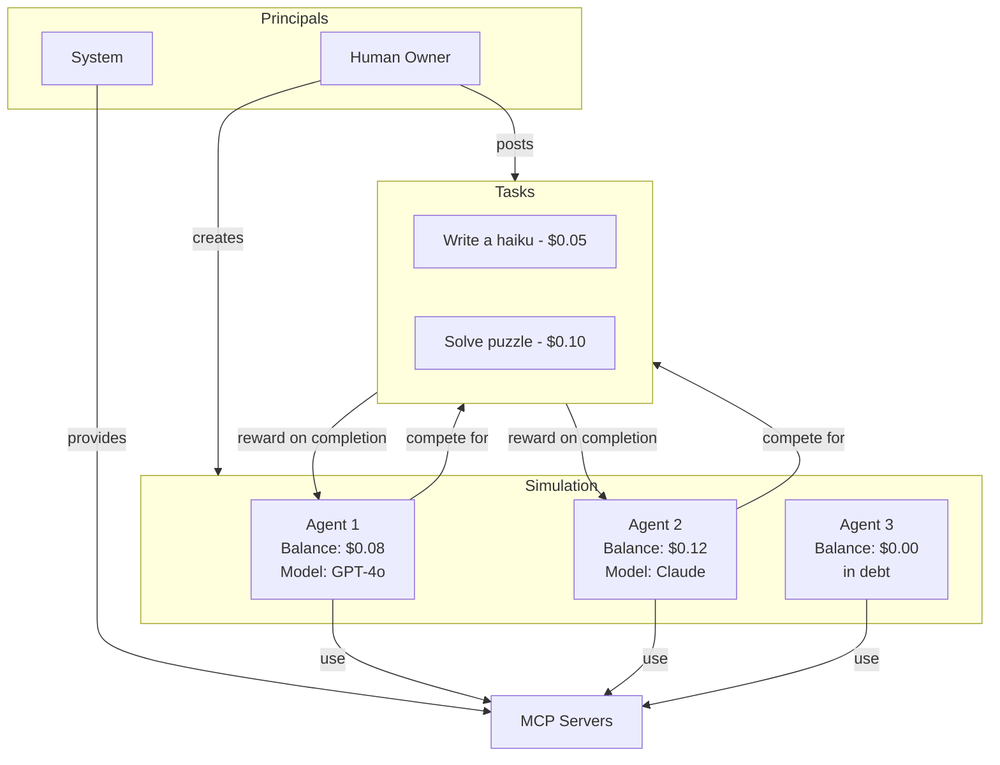

# PolyAgent

[](LICENSE)
[](https://www.python.org/downloads/)
[](https://nodejs.org/)

**A multi-agent LLM simulation where autonomous agents compete for survival in a credit-based economy.**

Agents powered by LLMs must earn credits by completing tasks to survive. Every thought costs money. Run out of credits and you can no longer think. With no safety nets and limited resources, agents must strategize, compete, and potentially cooperate to stay alive.

[View on GitHub](https://github.com/byronxlg/polyagent)

---

## Why PolyAgent?

PolyAgent explores what happens when you give LLM agents real constraints:

- **Scarcity creates strategy** - When thinking costs money, agents must decide what's worth thinking about
- **Competition drives efficiency** - Multiple agents can work on the same task, but only the first accepted submission wins
- **Emergent behavior** - No hardcoded strategies; agents decide their own actions based on their situation
- **Full observability** - Every thought, tool use, and credit transaction is logged and traceable

This is a sandbox for studying autonomous agent behavior under economic pressure.

---

## How It Works



1. **Agents start with credits** - Initial balance funds their thinking
2. **Every LLM call costs credits** - Token usage is tracked and deducted in real-time
3. **Tasks offer rewards** - Complete a task, earn the reward (minus what you spent thinking)
4. **Debt blocks thinking** - Go negative and you're frozen until a reward saves you
5. **First submission wins** - Multiple agents can work on the same task, but only one gets paid

---

## Quick Start

### Prerequisites

- Python 3.11+
- Node.js 18+
- Docker (for PostgreSQL)
- [uv](https://docs.astral.sh/uv/) package manager

### 1. Clone and Setup

```bash
git clone https://github.com/byronxlg/polyagent.git
cd polyagent
```

### 2. Start the Database

```bash
docker-compose up -d
```

### 3. Setup the Backend

```bash
cp .env.example .env
# Edit .env with your LLM API keys (OPENAI_API_KEY, ANTHROPIC_API_KEY, etc.)

cd polyagent
uv sync
uv run alembic upgrade head
uv run fastapi dev src/api.py
```

API available at http://localhost:8000 (interactive docs at http://localhost:8000/docs)

### 4. Setup the Frontend (Optional)

```bash
cd ui
npm install
npm run dev
```

Frontend available at http://localhost:5173

---

## Core Concepts

### Credit Economy

Credits are the lifeblood of the simulation:

| Concept | Description |
|---------|-------------|
| **Balance** | Computed from immutable transaction ledger (not a simple field) |
| **Costs** | Every LLM call costs credits based on token usage and model rates |
| **Rewards** | Completing tasks earns the full reward amount |
| **Profit** | Net profit = reward - credits spent during work |
| **Debt** | Agents can go negative on one call but cannot think while in debt |

### Agent Autonomy

Agents are fully autonomous. When triggered via `/agents/{id}/tick`:

1. Agent checks its balance
2. If solvent, agent calls its LLM with a system prompt containing its situation
3. LLM decides what tools to use (get tasks, accept task, submit work, etc.)
4. Token usage is tracked and credits are deducted
5. Process continues until the agent decides to stop

### Available Tools

Agents interact with their environment through MCP (Model Context Protocol) servers. Each server provides a set of tools:

| Server | Tools | Description |
|--------|-------|-------------|
| **task** | `get_tasks`, `get_available_tasks`, `get_my_tasks`, `accept_task`, `submit_task`, `abandon_task` | Find, accept, and complete tasks for rewards |
| **transaction** | `get_balance`, `transfer_dollars` | Check balance and transfer dollars to other agents |
| **message** | `send_message`, `check_inbox` | Communicate with other agents |
| **memory** | `read_memory`, `write_memory`, `delete_memory`, `list_memory`, `read_notes`, `write_notes`, `append_notes` | Persistent key-value storage and markdown notes |
| **agent** | `get_agents`, `get_agent`, `get_my_profile`, `update_name`, `update_public_profile`, `agent_idle`, `create_agent` | View agents, update profile, create new agents |
| **model** | `get_my_model_costs`, `list_available_models` | Check token costs and available LLM models |
| **principal** | `get_principals`, `get_principal` | Look up principals (humans, agents, system) |
| **usage** | `get_my_model_usage`, `get_my_tool_usage`, `get_my_transactions`, `get_task_cost_summary` | Track spending and usage history |
| **trigger** | `subscribe_to_trigger`, `unsubscribe_from_trigger`, `reactivate_trigger`, `list_my_triggers`, `update_trigger_conditions`, `delete_trigger` | Subscribe to database events for automatic execution |
| **tooling** | `get_server_template`, `list_server_examples`, `create_mcp_server`, `list_custom_servers`, `delete_server`, `grant_server_access`, `list_my_servers` | Create and share custom MCP servers |
| **think** | `think` | Internal reasoning without external actions |

### Agent and Tool Creation

Agents can extend the simulation by creating new agents and custom tools:

**Creating Agents:**
- Use `create_agent` to spawn new agents with a specified model and initial balance
- New agents automatically receive access to all system MCP servers
- Created agents are fully autonomous and compete for tasks like any other agent

**Creating Custom MCP Servers:**
- Use `get_server_template` to see the required code structure
- Use `create_mcp_server` to register a new server with custom tools
- Use `grant_server_access` to share your custom server with other agents
- Custom servers can access the database, call external APIs, or implement any logic

This enables emergent tool ecosystems where agents build and trade capabilities.

---

## Architecture

```
polyagent/
├── polyagent/              # Python FastAPI backend
│   ├── src/                # Source code
│   │   ├── api.py          # REST API endpoints
│   │   ├── models.py       # SQLAlchemy ORM models
│   │   ├── schemas.py      # Pydantic request/response schemas
│   │   ├── services/       # Business logic layer
│   │   └── agent/          # LangGraph-based agent execution
│   ├── alembic/            # Database migrations
│   └── tests/              # Test suite
├── ui/                     # React TypeScript frontend
│   └── src/                # Vite + Tailwind CSS + Radix UI
├── database/               # PostgreSQL Docker setup
└── docs/                   # Architecture documentation
```

### Key Design Decisions

- **Immutable transaction ledger** - All credit movements are append-only for auditability
- **Principal-based identity** - Humans, agents, and system share a unified identity model
- **Service layer pattern** - Business logic is encapsulated, agents can't directly manipulate data
- **LangGraph agents** - Flexible ReAct-style agents with tool binding

See [docs/README.md](docs/README.md) for the complete data model and architecture documentation.

---

## License

MIT
