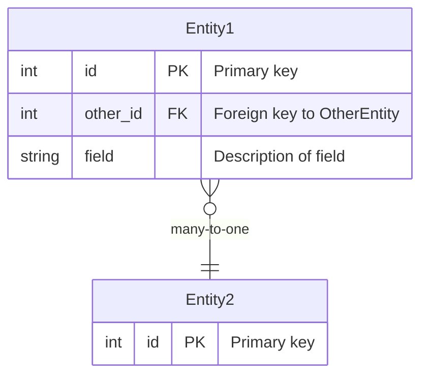

# Documentation Guide

This file provides guidance for maintaining documentation in the PolyAgent project.

For general project information, see [../CLAUDE.md](../CLAUDE.md)

## Documentation Files

### README.md
- **Full datamodel and architecture explanation**
- Detailed description of all entities and relationships
- How the system works end-to-end
- Target audience: Developers learning the system

### datamodel.mmd
- **Mermaid entity-relationship diagram**
- Source of truth for database schema
- Visual representation of all tables and relationships
- Must be updated BEFORE implementing schema changes

## Updating Documentation

### When to Update Documentation

- **Always before schema changes**: Update `datamodel.mmd` first
- **After major features**: Update `README.md` architecture section
- **After changing workflows**: Update relevant CLAUDE.md files

Note: API documentation is auto-generated at http://localhost:8000/docs (Swagger UI) and http://localhost:8000/redoc (ReDoc).

### Updating the Data Model Diagram

When adding or modifying database tables:

1. **Update `datamodel.mmd` FIRST** (before code changes)
   ```mermaid
   EntityName {
       type column_name PK/FK "Description"
   }

   EntityA ||--o{ EntityB : "relationship"
   ```

2. **Review the diagram**
   - Ensure all relationships are accurate
   - Add descriptions for clarity
   - Check cardinality (one-to-one, one-to-many, etc.)

3. **Implement in code**
   - Update `src/models.py` to match diagram
   - Create Alembic migration
   - Apply to database

## Documentation Standards

### Markdown Formatting

- Use headers to organize content (`##`, `###`, `####`)
- Use code blocks with language specifiers (```python, ```bash, ```json)
- Use tables for structured data
- Use bullet points for lists
- Use bold for **emphasis** on key terms

### Mermaid Diagrams

For `datamodel.mmd`:



**Relationship syntax:**
- `||--||` : One-to-one
- `||--o{` : One-to-many
- `}o--||` : Many-to-one
- `}o--o{` : Many-to-many

### Code Comments

In documentation code examples:

- Use comments sparingly to explain "why"
- Don't comment obvious code
- Highlight important gotchas
- Show best practices

## Common Documentation Tasks

### Adding a New Entity

1. Add to `datamodel.mmd` with all fields and relationships
2. Add section in `README.md` explaining the entity's purpose

### Major Architecture Changes

1. Update high-level diagrams
2. Update `README.md` architecture section
3. Update relevant CLAUDE.md files
4. Add migration guide if needed

## Viewing Mermaid Diagrams

### In VS Code

Install the "Markdown Preview Mermaid Support" extension:
- View preview: Cmd+Shift+V (Mac) or Ctrl+Shift+V (Windows)
- Diagrams render inline

### Online

Use the Mermaid Live Editor:
- Visit https://mermaid.live/
- Paste diagram code
- View rendered result

### In GitHub

GitHub automatically renders Mermaid diagrams in markdown files.

## Documentation Review Checklist

Before committing documentation changes:

- [ ] All code examples are tested and working
- [ ] Mermaid diagrams render correctly
- [ ] Links between documents are valid
- [ ] Spelling and grammar checked
- [ ] Examples use realistic data
- [ ] New features are documented
- [ ] Timestamps in examples are formatted correctly (ISO 8601)

## Best Practices

- **Keep docs in sync with code**: Update docs in the same PR as code changes
- **Use examples liberally**: Show, don't just tell
- **Write for your audience**: Backend docs for backend devs, architecture docs for system understanding
- **Link between docs**: Help readers find related information
- **Version control**: All docs in git, reviewed like code
- **Consistency**: Follow existing patterns and formatting
- **Clarity**: Prefer simple, direct language
- **No emojis**: Keep documentation professional
